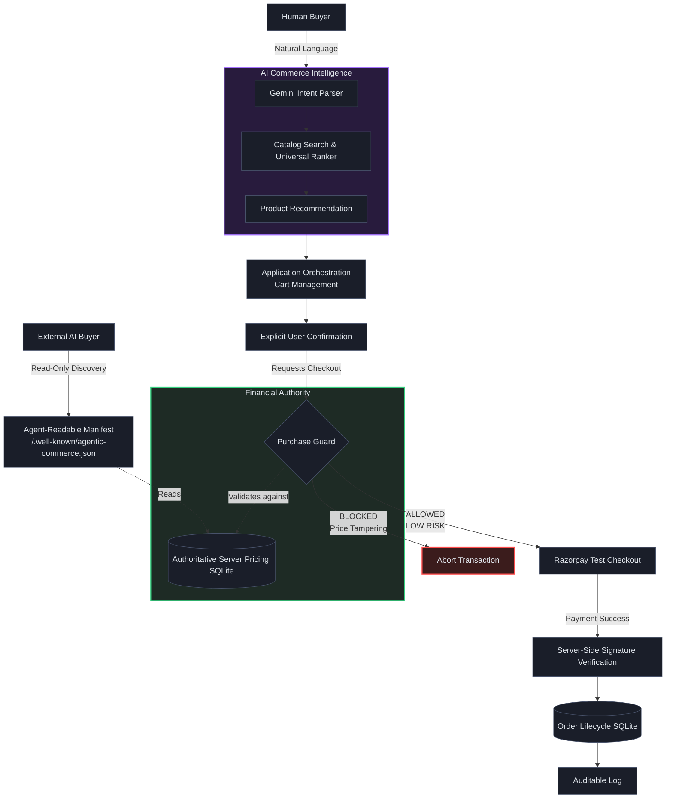

# RazorGuard AI - Architecture

RazorGuard AI implements a strict separation of concerns, dividing Agentic Commerce Intelligence from Financial Authority.

## Core Flow

## Architectural Tenets
1. **AI Discovery is Open:** The AI can rank, search, and parse intent. External agents can read the B2A manifest.
2. **Financial Authority is Gated:** The AI cannot authorize checkout. Purchase Guard independently evaluates the request.
3. **Server-Side Sovereignty:** The frontend price is never trusted. Purchase Guard deterministically recalculates the total using the server's SQLite database.
4. **B2A Does Not Bypass Security:** The agent-readable catalog is read-only. External agents must still pass through explicit confirmation and Purchase Guard to execute a payment.
