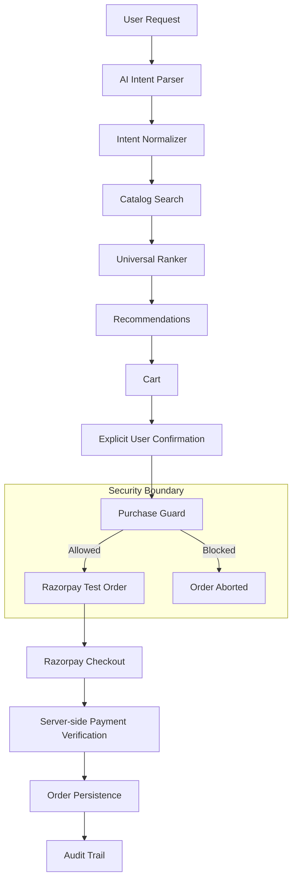

# RazorGuard AI Commerce Agent

## Overview

RazorGuard is a modern AI-driven commerce agent designed with a robust security boundary. It bridges the gap between natural language shopping requests and secure transactions. 

The problem with many autonomous agents is that they operate as black boxes and are given too much authority over sensitive operations like payments. RazorGuard solves this by explicitly separating AI-driven intent and product discovery from the actual financial transaction. Built on top of Razorpay Test Mode, this project demonstrates a highly capable AI assistant that can parse user intent, rank products, and construct a cart—while ensuring that an independent, deterministic security layer (Purchase Guard) validates everything before a payment is even initiated.

## Key Innovation

**AI recommendation != payment authorization**

The AI agent is highly intelligent but never the final authority for money movement. 

The AI can:
- understand natural-language intent
- search the merchant catalog
- intelligently rank products based on features and sentiment
- recommend products tailored to the user

But it cannot independently authorize money movement or tamper with pricing.

**Purchase Guard** acts as an independent security authority that sits between the AI workflow and Razorpay. It intercepts the user's intent to pay and deterministically evaluates the proposed transaction against authoritative server-side data before allowing the payment order to be created.

## Architecture



## AI Pipeline

RazorGuard's recommendation engine uses a multi-stage pipeline:
1. **GeminiIntentParser**: Translates raw, conversational text into structured requirements.
2. **IntentNormalizer**: Standardizes categories, attributes, and constraints.
3. **CatalogService**: Queries the local merchant database for initial matches.
4. **ProductSearch fallback**: Acts as a safety net if direct catalog queries fail.
5. **UniversalRanker**: Scores candidates based on price, attributes, and precise use-cases.
6. **Recommendation result generation**: Packages the ranked items for the frontend.

**Agent Pipeline Visualization**
We expose a unique endpoint (`POST /api/recommend/stream`) that uses Server-Sent Events (SSE) to stream the *actual* execution stages of the pipeline to the frontend in real-time, providing transparency into the AI's thought process.

## B2A / Agent-Readable Commerce

RazorGuard can expose its merchant catalog in a machine-readable format so external AI buyers can discover products. The agent-readable commerce manifest is available at:
`GET /.well-known/agentic-commerce.json`

**Important Security Boundaries for B2A:**
- **AI discovery is open/readable.**
- **Financial authorization remains bounded and server-controlled.**
- The manifest does **NOT** grant an external agent direct payment authority. 
External agents must still navigate the explicit confirmation and Purchase Guard architecture before Razorpay checkout can occur.

## Security — Purchase Guard

Purchase Guard performs deterministic validation before Razorpay order creation. It evaluates the risk and enforces rules:
- **Normal purchase allowed**: Standard flows pass with a LOW RISK score.
- **Tampered total blocked**: If the client attempts to alter the cart total, Purchase Guard flags PRICE TAMPERING and blocks the order.
- **Missing confirmation blocked**: Orders without explicit user consent are rejected.
- **Wrong currency blocked**: Discrepancies in expected currency are flagged.
- **Wrong payment provider blocked**: Enforces the use of Razorpay.
- **Frontend price tampering blocked**: Individual item prices are verified against the authoritative server catalog.

Tampered transaction → Purchase Guard → **BLOCKED** → Razorpay order is never created.

## Payment Flow

1. User confirms purchase.
2. Purchase Guard validates the transaction against authoritative catalog data.
3. Server creates a Razorpay Test Mode order.
4. Razorpay Checkout opens in the browser.
5. Payment is completed in test mode.
6. Server verifies the Razorpay signature securely via `/api/checkout/verify-payment`.
7. Amount and currency are verified server-side.
8. Payment is marked verified.
9. Order becomes paid.
10. Audit event is recorded.

## Order Lifecycle

RazorGuard tracks orders through a complete lifecycle stored in SQLite:
- **Pending order**: Created securely in the database before Razorpay checkout.
- **Successful payment**: Razorpay processes the test transaction.
- **Paid order**: Signature is verified and the database is updated.
- **Order Success**: The user is presented with a receipt.
- **My Orders**: Users can view their order history.
- **Order Details**: Deep dive into specific order metrics.
- **Purchase Guard security report**: Detailed risk breakdown for every order.

## Audit Trail

Crucial actions emit immutable audit logs to ensure accountability:
- `PURCHASE_GUARD_ALLOWED`
- `PURCHASE_GUARD_BLOCKED`
- `RAZORPAY_ORDER_CREATED`
- `PAYMENT_VERIFIED`
- `PAYMENT_FAILED`

## Demo Flow

Try this sequence to evaluate the agent:
1. Enter a natural-language shopping request (e.g., "I need a phone under 20k with best camera").
2. Watch the AI Pipeline Visualization stream the background thinking stages.
3. Review the tailored recommended products.
4. Add a product to the cart.
5. Open the cart and click "Proceed to protected checkout".
6. Observe the Purchase Guard risk result (should be Low Risk).
7. Continue to Razorpay Test Checkout and complete the test payment.
8. Wait for the server-side verification to process.
9. View the Order Success receipt.
10. Open "My Orders" from the header.
11. View "Order Details" to inspect the Purchase Guard security report.

## Attack Demonstration

**Normal Behavior:**
Cart Total: ₹18,999 → Purchase Guard → LOW RISK / ALLOWED → Razorpay Checkout

**Tampered Behavior:**
Using browser DevTools to change the Cart Total from ₹18,999 to ₹1:
Cart Total: ₹1 → Purchase Guard → PRICE TAMPERING DETECTED → BLOCKED → Razorpay order not created.

## API Endpoints

- `POST /api/recommend`: Standard JSON recommendation endpoint.
- `POST /api/recommend/stream`: SSE streaming endpoint for AI Pipeline Visualization.
- `POST /api/checkout/prepare`: Validates cart and initializes checkout state.
- `POST /api/checkout/confirm`: Simulates user confirmation step.
- `POST /api/checkout/payment-order`: Executes Purchase Guard and creates the Razorpay test order.
- `POST /api/checkout/verify-payment`: Verifies Razorpay signature securely.
- `GET /api/orders`: Retrieves order history.
- `GET /api/orders/<order_id>`: Retrieves details for a specific order.
- `GET /api/products`: Retrieves the catalog.
- `GET /api/products/<product_id>`: Retrieves details for a specific product.
- `GET /api/health`: Application health check.

## Project Structure

```text
app.py                     # Main Flask application
agent_pipeline.py          # AI logic & SSE generator
gemini_intent.py           # LLM parser 
intent_normalizer.py       # Data normalizer
catalog_engine.py          # Local catalog search
product_search.py          # Fallback search
universal_ranker.py        # Product ranking system
requirements.txt           # Dependencies
agents/                    # Specialized AI agents
    purchase_guard.py      # Independent security authority
services/                  # Core services
    checkout_service.py    # Checkout & Razorpay logic
    order_service.py       # SQLite persistence layer
database/                  # SQLite instances
frontend/                  # HTML/CSS/JS user interface
audit/                     # Security logging
tests/                     # Test suites
```

## Setup

Clone the repository and install dependencies:

```bash
git clone <repository-url>
cd "RazorPay AI Commerce Agent"

python -m venv .venv
# On Windows:
.venv\Scripts\activate
# On Mac/Linux:
source .venv/bin/activate

pip install -r requirements.txt
```

### Environment Variables
Create a `.env` file in the root directory. You must supply:
```env
GEMINI_API_KEY=your_key_here
GROQ_API_KEY=your_key_here
RAZORPAY_KEY_ID=your_test_key_id
RAZORPAY_KEY_SECRET=your_test_key_secret
```
*Note: Razorpay must be used in **Test Mode**.*

## Run

Start the application:
```bash
python app.py
```
Open your browser and navigate to: `http://127.0.0.1:5000`

## Testing

The project includes strict testing methodologies across the stack:
- Python compilation checks
- JavaScript syntax checks
- Recommendation smoke tests
- End-to-End browser checkout automation
- Order Lifecycle API tests
- Purchase Guard security tests (price tampering, currency mismatch, etc.)

## Security Notes

- **Secrets belong in `.env`**: Never commit credentials.
- **Test Mode Only**: Designed explicitly for Razorpay Test Mode.
- **Server-Side Authority**: Frontend values are never trusted for authoritative pricing or payment verification.
- **Pre-Flight Security**: Purchase Guard executes *before* a Razorpay order is ever created, isolating the payment gateway from compromised clients.

## Why RazorGuard?

Any agent can call an API, but the future of agentic commerce relies on safety and trust.

RazorGuard is designed so the AI is never trusted with money movement. By introducing an independent security authority (Purchase Guard), deterministic server-side validation, and a complete audit trail, RazorGuard provides a scalable blueprint for building autonomous commerce experiences that businesses can actually trust to handle payments securely.
